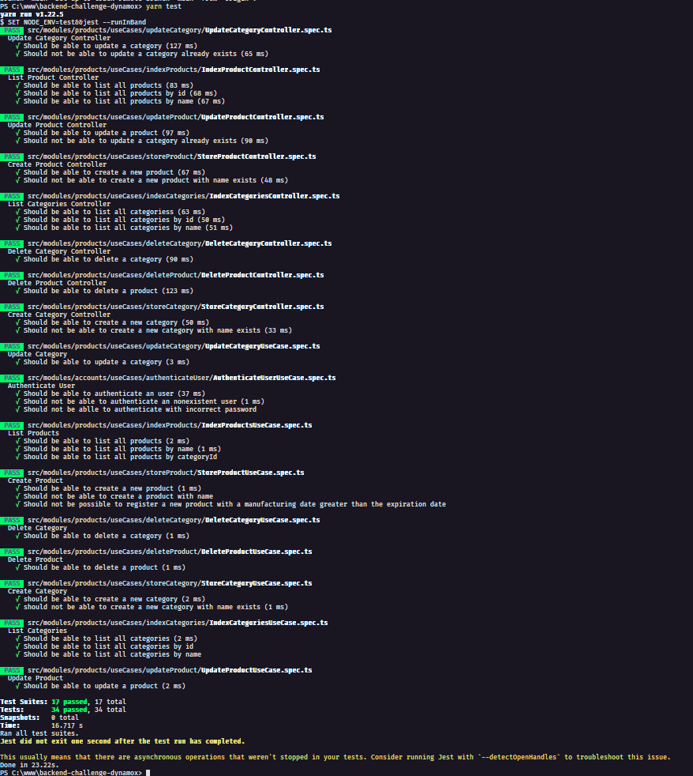
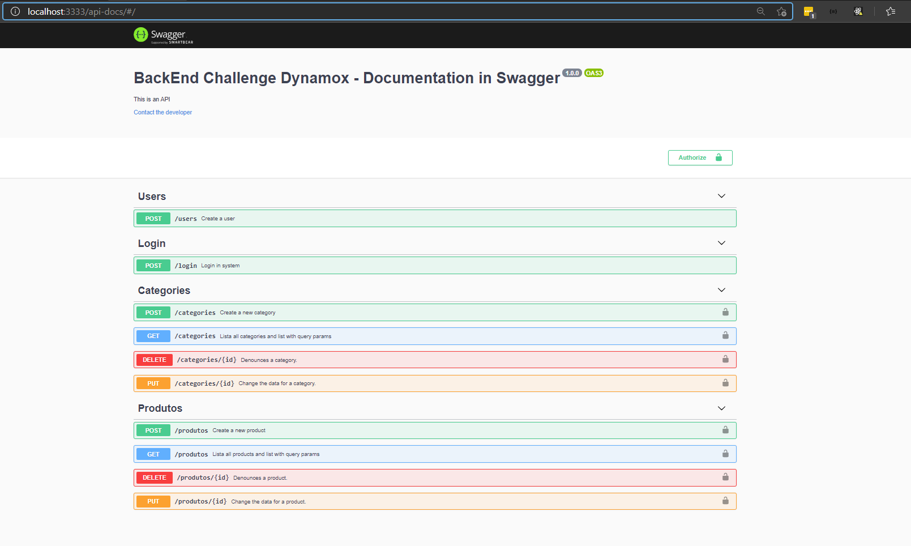

<h1 align="center">🚀 Dynamox - BackEnd Challenge</h1>
<p align="center">
  API RESTfull para gerenciamento de produtos e categorias, com controle e autenticação de usuários com JWT.
  <br>
</p>
<h1 align="center">:pushpin: Sobre o desafio</h1>
<p align="left">
  Nesse desafio, foi utilizado varios princípios, um deles o SOLID para trabalhar a programação orientada a objetos e design de código.

### Introdução
  Criar um gerenciador de produtos e categorias, com controle e autenticação de usuários.

### O Projeto
  Desenvolver uma API RESTful utilizando nodejs e banco de dados relacional. Cada produto deve pertencer a uma categoria pré registrada no sistema.

### Funcionalidades

#### ● Usuários
  ○ (store) Cadastrar usuário
  ○ (login) Login de usuário retornando um bearer token para utilizar nas
  chamadas abaixo
#### ● Categorias
  ○ (store) Cadastrar categoria
  ○ (update) Atualizar categoria
  ○ (delete) Remover categoria
  ○ (show) Exibir categoria
  ○ (index) Listar categorias
#### ● Produtos
  ○ (store) Cadastrar produto
  ○ (update) Atualizar produto
  ○ (delete) Remover produto
  ○ (show) Exibir produto
  ○ (index) Listar produtos
    ■ Filtrar por categorias

### Regras de negócio
  ● A data de fabricação nunca deve ser maior que a data de validade;
  ● O Preço do produto deverá ser registrado com 2 casas decimais;
  ● A listagem deve ter a possibilidade de ordenação dos campos e com uma paginação de 10 produtos por página.
  <br>
</p>

<h1 align="center">:pushpin: Algumas das tecnologias utilizadas</h1>
<p align="center">
  Abaixo estão algumas das tecnologias utilizadas durante o desenvolvimento do backend. Ainda foi visado: Organizar o diretório da nossa aplicação de forma concisa, limpa e eficiente. Escrever código limpo visando reutilização e eficiência e criar testes unitários de integração.
</p>
<br/>
<p align="center">
  
  
  
  
  
</p>
<p align="left">

### :keyboard: Instalação e Execução do Projeto

- Clone este repositório

```
> git clone https://github.com/danielgorgonha/backend-challenge-dynamox
```

- Navegue até o diretório principal do projeto

```
> cd backend-challenge-dynamox
```

- Instale as dependências com o Yarn

```
yarn
```

- Utilizando o Docker Compose

```
docker-compose up -d
```

- Instale as migrations

```
yarn typeorm migration:run
```

- Insert Administrator - (Acesse a rota /login, passando { email e password } para ter acesso ao token JWT)

```
yarn seed:admin
```

- Rode a suite de testes

```
yarn test
```

- Execute o projeto

```
yarn dev
```
</p>
<br/>
<p align="center">
  
</p>

### Documentações com Swagger
## O que foi documentado?

Neste desafio foi documentado as entradas e saídas da API. Abaixo os principais pontos documentado:

- Informações gerais da API (nome, descrição, etc.);
- Rotas;
- Parâmetros;
- Corpo da Requisição;
- Respostas de sucesso;
- Respostas de erro;
- Exemplos;

<p align="center">
  
</p>

## :memo: Licença

Esse projeto está sob a licença MIT. Veja o arquivo [LICENSE](https://github.com/git/git-scm.com/blob/master/MIT-LICENSE.txt) para mais detalhes.

---

Feito com 💜 by <a href="https://www.linkedin.com/in/danielgorgonha/">Daniel R Gorgonha</a> :wave:
